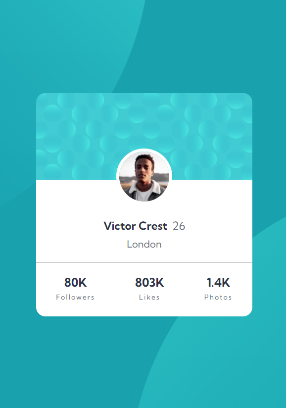

# Profile card component

Building realistic projects to improve my front-end skills.

## Screenshots

### Links

- Live Site URL: [Profile card component](https://prof1le-card.netlify.app/)

## Built with

- Semantic HTML5 markup
- CSS custom properties
- Flexbox
- CSS Grid
- Mobile-first workflow
- [Styled Components](https://styled-components.com/) - For styles
